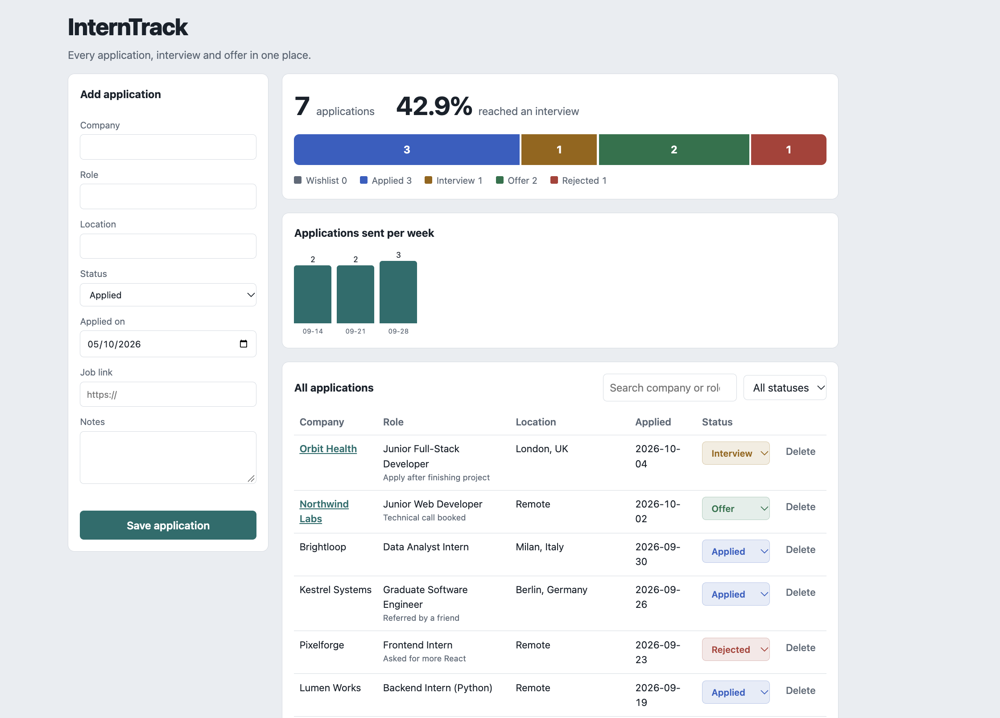

# InternTrack

[](https://github.com/iPraful-codes/interntrack/actions/workflows/ci.yml)


A full-stack job application tracker. Log every application, move it through a pipeline (Wishlist, Applied, Interview, Offer, Rejected), and see how your search is going: pipeline breakdown, interview rate, and applications sent per week.

I built it while searching for my first engineering internship, so it solves a problem I actually have.

**Live demo:** https://interntrack-i52s.onrender.com



## Features

- Create, edit, search, filter and delete applications
- Change status inline and watch the stats update
- Analytics computed in SQL: counts by status, interview rate, weekly activity
- REST API with input validation and proper status codes (400, 404, 201, 204)
- Automated tests and a CI pipeline on every push

## Tech stack

| Layer | Tools |
| --- | --- |
| Frontend | HTML, CSS, vanilla JavaScript (no frameworks) |
| Backend | Python, Flask |
| Database | SQLite (plain SQL, parameterised queries) |
| Quality | pytest, GitHub Actions |

## Run it locally

```bash
git clone https://github.com/iPraful-codes/interntrack.git
cd interntrack
python -m venv .venv && source .venv/bin/activate   # Windows: .venv\Scripts\activate
pip install -r requirements-dev.txt
python seed.py        # optional demo data
python run.py         # http://127.0.0.1:5000
```

Run the tests with `pytest`.

## API

| Method | Endpoint | Description |
| --- | --- | --- |
| GET | `/api/applications?status=&q=` | List, optionally filtered by status or search text |
| POST | `/api/applications` | Create (`company` and `role` required) |
| PUT | `/api/applications/<id>` | Update one or more fields |
| DELETE | `/api/applications/<id>` | Delete |
| GET | `/api/stats` | Totals, counts by status, interview rate, weekly activity |

## Design decisions

- **SQL does the analytics.** Grouping and weekly bucketing happen in queries rather than in JavaScript.
- **Safe by default.** Queries are parameterised, only whitelisted fields are accepted, job links must be `http(s)`, and the UI builds the DOM with `textContent` so user input is never rendered as HTML.
- **App factory pattern.** `create_app()` accepts config, which lets tests run against a throwaway database.
- **No frontend framework.** The goal was to show I understand the fundamentals of the DOM and `fetch`.

## Project structure

```
app/
  __init__.py      Flask app, validation, API routes
  schema.sql       Table definition and index
  templates/       index.html
  static/          app.js, style.css
tests/test_api.py  API tests
seed.py            Demo data
run.py             Local entry point
```

## Deploy

On Render or Railway, use build command `pip install -r requirements.txt` and start command `gunicorn "app:create_app()"`. SQLite lives on the server's disk, so a free instance resets its data when it restarts.

## Roadmap

- [ ] User accounts and per-user data
- [ ] Follow-up reminders
- [ ] CSV export
- [ ] Switch to PostgreSQL

## License

MIT, see [LICENSE](LICENSE).
